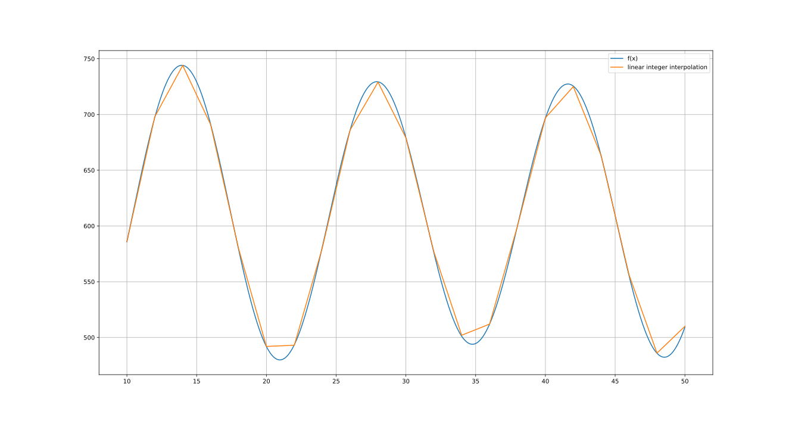

Linear Integer Interpolation

A python script to compute, from any real function, a linear interpolation using integer coefficients.

Given a real function  defined on a real interval  and a number of subinterval , compute interpolated segments of the form  where n and m are integer numbers.


```python
from math import sin, cos

def f(x):
    return -10.11 * sin(x) + 125.221 *cos(45.2 * x)

interp = linear_interpolation(f, interval=[10, 50], segments=20)
print(interp)
```

```bash
[(56, 26), (23, 422), (-26, 1108), (-56, 1587), (-44, 1372),
 (1, 472), (44, -475), (53, -692), (22, 114), (-25, 1429), (-51, 2209),
 (-38, 1793), (5, 332), (44, -1072), (48, -1224), (14, 137), (-31, 2027),
 (-54, 3039), (-35, 2166), (12, -90), (50, -1990)]
```

